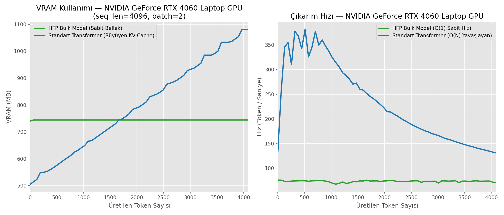

# Hyper Flux Projection (HFP) Causal Language Model

HFP (Hyper Flux Projection) is a novel, physics-inspired neural network architecture designed for causal language modeling. It introduces advanced physics concepts into the standard Transformer architecture and optimization process, aiming to achieve more stable, coherent, and physically-grounded learning trajectories.

## Key Innovations

The HFP architecture replaces conventional ad-hoc regularizations with strict mathematical/physical analogues:

- **Hyper Flux Core**: A redesigned state-space that captures long-range dependencies efficiently.
- **Quantized Energy Levels (QuantizedLR)**: A learning rate scheduler inspired by quantum mechanics. Instead of arbitrary continuous decay, the learning rate transitions between discrete, stable energy levels based on loss plateaus.
- **Stiff Transient Scheduler**: An inverse-time decay mechanism that introduces "stiffness" to the learning rate, allowing aggressive initial exploration followed by highly stabilized fine-tuning.
- **Uncertainty Regularizer**: A dynamic regularizer that penalizes chaotic states, enforcing thermodynamic coherence within the hidden states.
- **Curvature & Entropy Maps**: The architecture inherently tracks geometric curvature and gate entropy, emitting warnings when the representation space loses coherence (e.g., `Low coherence detected`).

## Architecture Details

The core model, `HFPForCausalLM` (~124M parameters), structurally maps to a standard Causal LM but intercepts and overrides the hidden state propagation using physics-informed modules.

### 1. Thermodynamic Context Compression & O(1) Memory Scaling
Unlike continuous linear attention (e.g., Google's Infini-attention) which blindly compresses data, HFP employs an **active thermodynamic trigger**. The short-term memory is constantly evaluated for its **Entropy** and **Curvature**. Once the entropy of the current cognitive state reaches a saturation threshold, the `bulk_trigger` activates, compressing the local context into a high-dimensional `bulk_state` (Long-term memory). 
**HPC Breakthrough (KV-Cache Elimination):** The memory update mechanism has been completely vectorized into a block-level operation. This reduces the time complexity from $O(N)$ to $O(1)$ per block, and completely eliminates the quadratic $O(N^2)$ VRAM consumption of standard KV-Caches. The architecture can process effectively infinite context sizes with constant, highly compressed VRAM footprint on single consumer GPUs.

### 2. Dual-Masked Self-Cross Attention (Linguistic Rigor)
To prevent "Causal Leakage" (predicting the future) while maintaining access to historical deep memory, HFP uses a custom Dual-Mask attention topology:
- **Local Context:** A strict Triangular Causal Mask prevents tokens from attending to future tokens within the local sequence.
- **Deep Context:** A Full Matrix Mask allows total, unhindered read-access to the 5D historical bulk memory.
*Coupled with injected Sinusoidal Positional Encodings, the model strictly adheres to temporal linguistic rules without positional blindness.*

### 3. Physics-Informed Internal State (`hfp_bulk_state` & `hfp_utils`)
The architecture introduces several non-standard tracking variables directly influenced by physical laws:
- **5D Radial Curvature:** Unlike standard models that only measure temporal change, HFP measures the second derivative across its *memory depth* (Short -> Medium -> Long). It calculates a Ricci-scalar proxy to regulate the internal "gravity" of the context window.
- **Witten Boundary-to-Bulk Propagator:** The transition of information from short-term memory (Boundary) to long-term memory (Bulk) is not linear. It is modulated by a warp factor $e^{-k \cdot S}$ based on the entropy (chaos) of the boundary, physically shielding the deep bulk from noisy inputs.
- **Ryu-Takayanagi Entropy Bound:** Inspired by the holographic entanglement entropy formula, the model enforces a strict mathematical bound: the entropy of the boundary cannot exceed the surface area of the bulk. If the model approaches hallucination, a ReLU penalty restricts the gradients.
- **Conservation Checks:** Enforces mathematical conservation laws across hidden states to ensure the model doesn't hallucinate context shifts out of thin air.

### 4. Quantum-Inspired Schedulers (`physics_optimizers.py`)
To solve the instability of LLM training (loss spikes):
- **QuantizedLR:** Instead of continuous cosine decay, the learning rate transitions through discrete "energy levels" (quanta) based on mathematical plateaus.
- **Stiff Transient Scheduler:** Applies "stiffness" (borrowed from stiff ODE systems) to the optimizer. It allows aggressive early exploration but applies immense thermodynamic braking during fine-tuning, preventing the model from collapsing.

## Theoretical Physics Foundations (The Geometry of Mind)

The HFP architecture is not merely "inspired" by physics; it is a direct computational implementation of the theoretical **Hyper-Flux Projection Model**, originally developed to resolve the black hole information paradox via a 5D Gravity-Dilaton action. 

The exact mapping between the theoretical physics and the neural architecture is as follows:

- **5D Bulk & 4D Brane Projection $\longleftrightarrow$ O(1) Memory Compression:** In physics, the 4D universe is a projection of a 5D Bulk where information is trapped in a Stiff Transient plateau. In this AI, the local context (4D Brane) projects its data into a fixed-size `bulk_state` matrix (5D Bulk) upon entropy saturation, replacing the expanding $O(N^2)$ KV-Cache with an $O(1)$ constant memory footprint.
- **Metric Warp Factors $\longleftrightarrow$ Witten Boundary-to-Bulk Propagator:** The extra-dimensional warp factors ($e^{2A(r)}$) governing metric contraction are implemented as the $e^{-k \cdot S}$ transition propagator, effectively shielding the deep bulk memory from chaotic, high-entropy inputs.
- **Fokker-Planck Drift & Center Manifold $\longleftrightarrow$ Thermodynamic Context Compression:** The cubic geometric flow ($d\theta/d\tau = -\tilde{\eta}\theta^3$) that dictates information leakage (Zeno Leakage) in the physical model dictates the AI's thermodynamic trigger, compressing data deterministically based on curvature and entropy rather than blindly attending to all tokens.
- **Holographic Principle (AdS/CFT) $\longleftrightarrow$ Ryu-Takayanagi Bound:** The AI mathematically limits the boundary network's entropy to not exceed the bulk memory's surface area, utilizing string theory's holographic entanglement entropy to physically prevent AI hallucinations.

## Quickstart & Benchmarks

The architecture includes a comprehensive benchmarking suite (`benchmark.py`) to validate O(1) memory scaling and quantum-inspired schedulers.

To run the full GPU memory benchmark and generate the O(1) vs KV-Cache comparison:
```bash
python benchmark.py
```

### O(1) Memory Proof
*(The script generates `benchmark_results_gpu.png` demonstrating constant VRAM consumption for effectively infinite context lengths.)*


To run a quick shape and causality test without generating graphs:
```bash
python benchmark_test.py
```

## License
This project is open-sourced under the **AGPL v3 License**. 
*Commercial entities utilizing this architecture over a network are required to open-source their modifications under the same license.* See the [LICENSE](LICENSE) file for more details.
